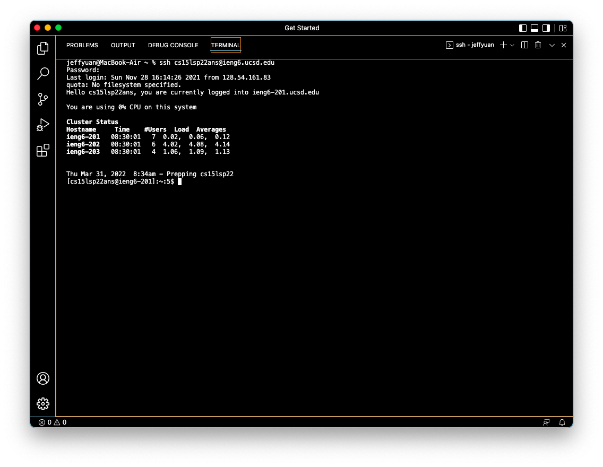

# Tutorial for CSE 15L Remote Access

**Hello Class!**
Welcome to UCSD CSE 15L. The first lab you will learn is how to utilize the remote system on ieng6.
So I have made this tutorial for you. Hope you enjoy it!

1. Installing VScode

2. Remotely Connecting
3. Trying Some Commands
4. Moving Files with scp
5. Setting an SSH Key
6. Optimizing Remote Running

