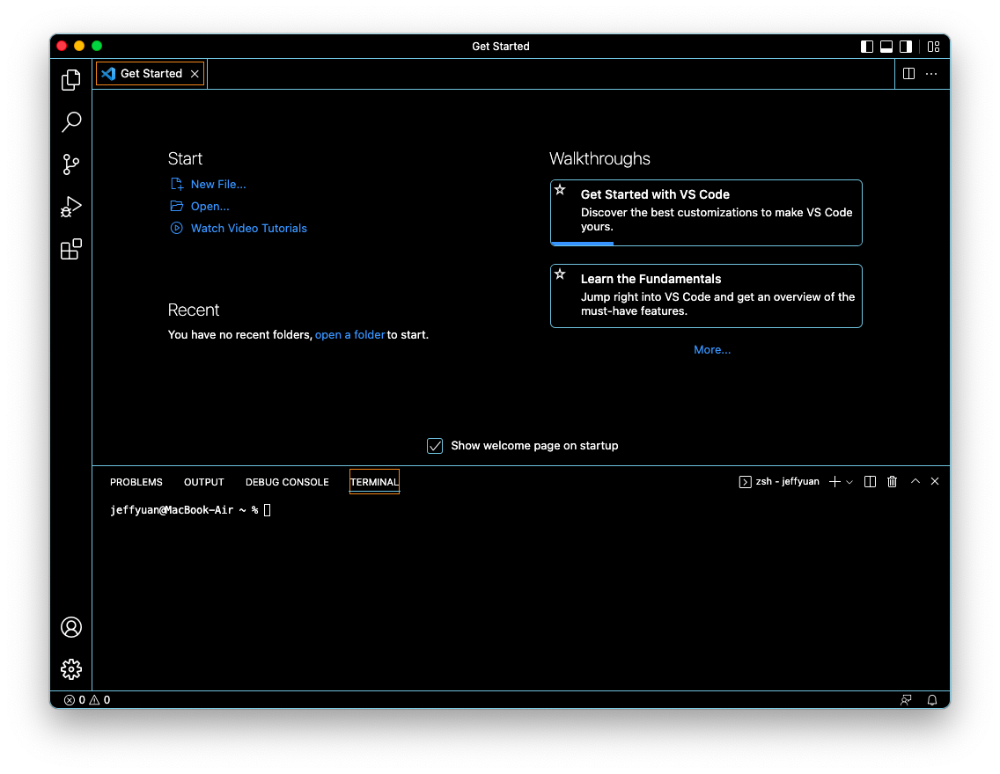
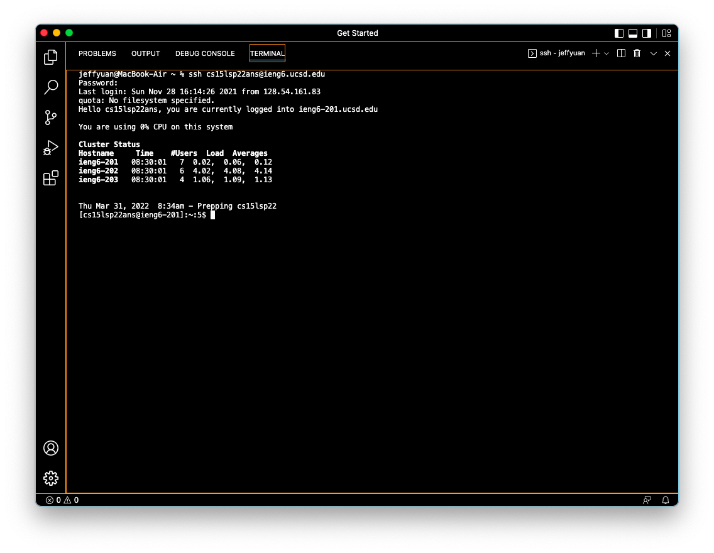
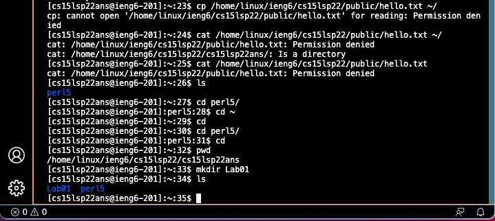
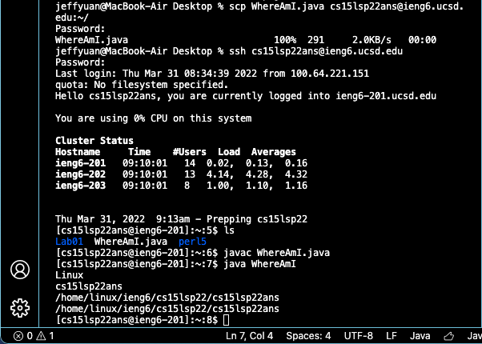
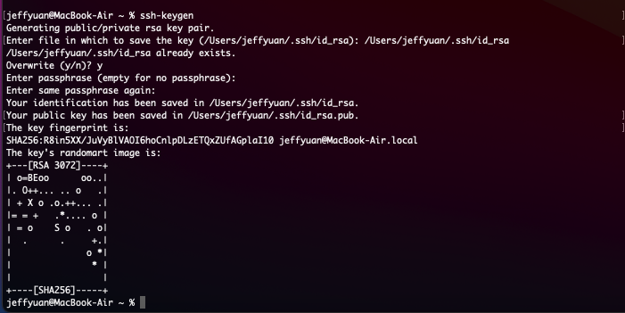
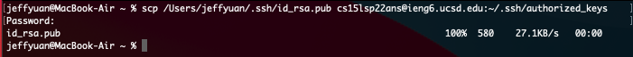
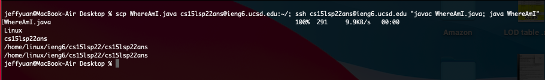

# Tutorial for CSE 15L Remote Access

**Hello Class!**
Welcome to UCSD CSE 15L. The first lab you will learn is how to utilize the remote system on ieng6.
So I have made this tutorial for you. Hope you enjoy it!

## 1. Installing VScode

If you haven't download the Visual Studio Code, click **[here](https://code.visualstudio.com)** to download it and install it to your computer.

Open the Visual Studio Code once you finish install it. You should see the picture similar to this: 

## 2. Remotely Connecting

Open a terminal in your Visual Studio Code.

In the terminal, type **"ssh cs15lsp22xxx@ieng6.ucsd.edu"** (Where the "xxx" should replace with your own username, the "cs15lsp22" stand for the cse 15l course, spring quarter, 2022; make sure to change them to your current class quarter and year)

Once you finish typing, press enter. Since it is likely your first time connect to this remote server, you will be ask for permittion to continue connecting, type "yes" and press enter to continue.

You will then see the line ask you to type your password, you then type your current ucsd password. **Notice, the password does not shows on your screen while you are typing, this is totally normal as it is part of terminal security setting.**

Once you finish typing your password, press enter. If the screen still ask your password, that means you have typed a wrong password. Try again. If you success, you should see a screen similar to this: 

*Now, you have successfully connected to the remote server! WOHOO*

## 3. Trying Some Commands

Now, let's try some commands on your remote server!

Here are some useful commands for you to try:
* cd ~
* cd
* ls -lat
* ls -a
* pwd
* mkdir "your own directory name, for example: homeworks"
* cp /home/linux/ieng6/cs15lsp22/public/hello.txt ~/

After several trys, you will see a screen that similar to this: 

## 4. Moving Files with scp

Now, let's learn how to copy and move files back and forth between our local computer and the remote server!

First, let's see how to copy a file from your local computer to the remote server. That means we will **start from our local computer**, logout from remote server by type "exit" if you haven't logout yet.

Create a file on your computer that called WhereAmI.java and type the following codes in it *(make sure to put spaces in the correct java format)*:

**class WhereAmI {
    public static void main(String[] args) {
        System.out.println(System.getProperty("os.name"));
        System.out.println(System.getProperty("user.name"));
        System.out.println(System.getProperty("user.home"));
        System.out.println(System.getProperty("user.dir"));
    }
}**

Run it using javac and java on your local computer in the terminal **(make sure you are in the same directory of the created file)**. You should see the working path of your current working directory of the file. If you have not installed the java on your local computer, don't worry, we can run it under the remote server!

**Under the same directory of the created file**, run this command with your own remote username:

**scp WhereAmI.java cs15lsp22xxx@ieng6.ucsd.edu:~/**

You then need to type your ucsd password like how you login to the server before.

After that. log into your remote server using ssh. Type "ls", you should see the WhereAmI.java file now copied on your remote server now. Since the server hace installed the java, you can now run the file in the remote server. Try it out!~ You should see a screen similar to this: 

## 5. Setting an SSH Key

Now, let's make our life easier by setting up the SSH keys so we don't have to type our password every time when we connect to remote server.

**On your local computer**

Follow the steps in the picture: (When ask you to enter the passphrase, make sure to **not** type anything and directly press enter)

Now on your remote server (log into your remote server again by using ssh, you still need password for now)

Create a new directory by type:

**mkdir .ssh**

Now, let's logout and go back to our local computer again (type "exit" to logout)

Type:

**scp /Users/"your own user name"/.ssh/id_rsa.pub cs15lsp22xxx@ieng6.ucsd.edu:~/.ssh/authorized_keys**

(Use your own username and the path when you did during your first step, you will still be ask your password, which will be the last time ask you for your password!)

After that, you should see something similar to this:

From now on, you don't have to type your password everytime you try to connect with the remote server!

## 6. Optimizing Remote Running

Lastly, there are some hints for you to make the remote running even smooth. 

1. You can write a command in quotetation marks at the end of an ssh command to directly run the command on your local computer without login the remote server.

2. You can use semicolons to run multiple commands in one line.

By using these two hints, we can copy the file from our local computer to remote server and run it over there with only one line command.

See the picture below:

Try combine some codes on your own to create some efficient commands!

From now on, you are ready to explore the beauty of the cs remote working style.