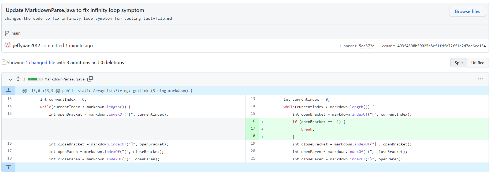
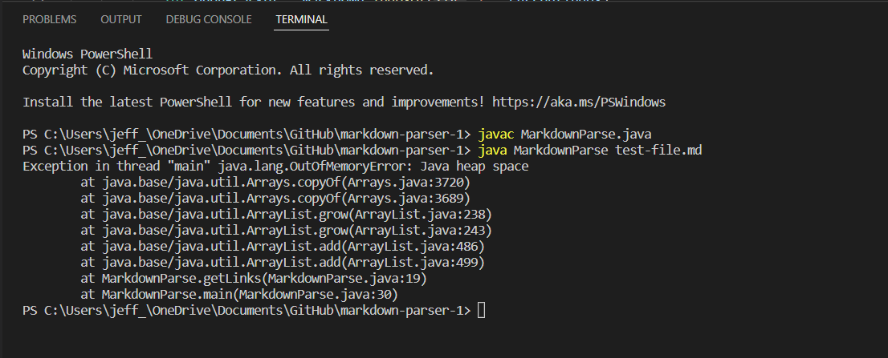
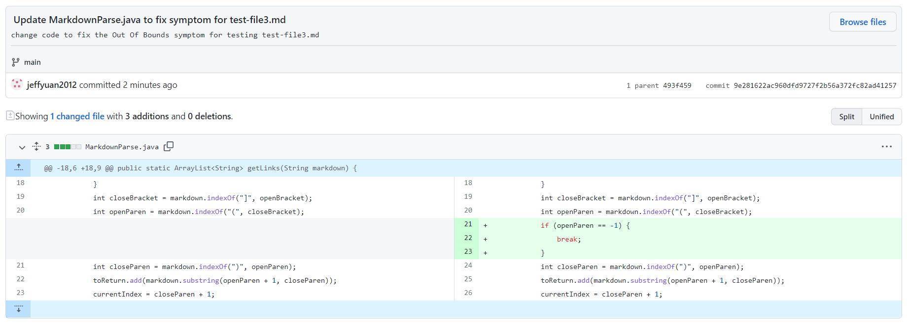
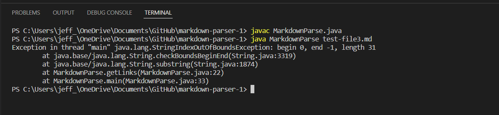
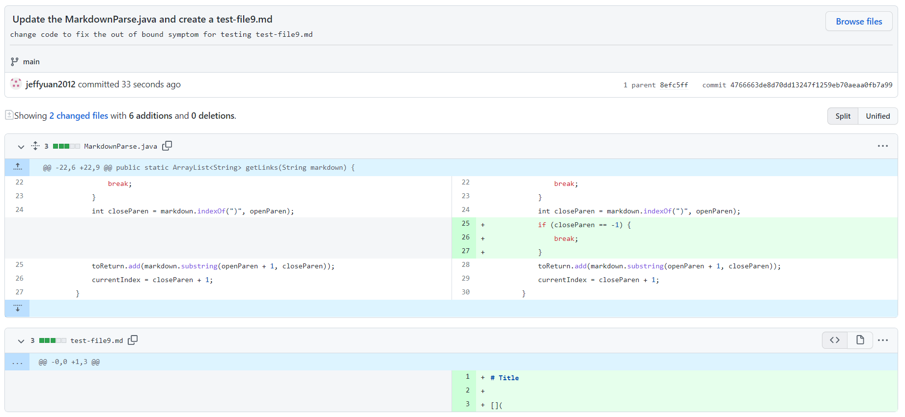
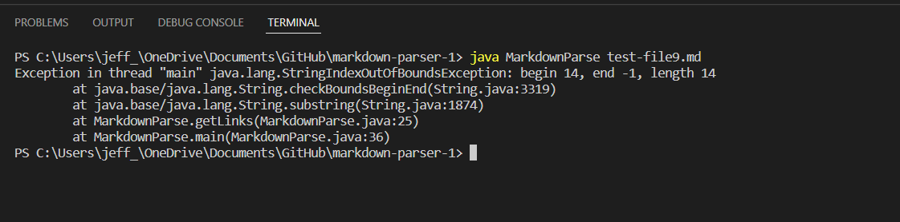

# Lab Report 2, Week 4
**Hello Class!** Welcome to UCSD CSE 15L. This is the second lab report for the course. In this lab, I'm going to show you three different bugs and the relationship between the bug, the symptom, and the failure-inducing input.

## Bug #1:
**Below is a screenshot of code change diff from Github for the first bugs:**

The link to the test file for a failure-inducing input is here: **[Link](https://github.com/jeffyuan2022/markdown-parser/blob/main/test-file.md)**

The symptom of that failure-inducing input is ***Infinite Loop*** 

**Below is a screeshot of the symptom in command line:**

**The relationship between the bug, the symptom, and the failure-inducing input:** 

Due to the failure-inducing input, that there is one additional empty line (line 5) of code after the last link in the test file, the testing program (MarkdownParse.java) caused a bug that it cannot find the next open bracket after the last link in the test file and it can't end the while loop. So as the symptom, it goes into an infinite loop when running the test.

## Bug #2:
**Below is a screenshot of code change diff from Github for the second bugs:**

The link to the test file for a failure-inducing input is here: **[Link](https://github.com/jeffyuan2022/markdown-parser/blob/main/test-file3.md)**

The symptom of that failure-inducing input is ***StringIndexOutOfBound*** 

**Below is a screeshot of the symptom in command line:**

**The relationship between the bug, the symptom, and the failure-inducing input:** 

Due to the failure-inducing input, that there is no open parentheses after the close bracket (line 3) in the test file, the testing program (MarkdownParse.java) caused a bug that it ends at index -1 since it cannot find the next open parentheses after the last close bracket in the test file. So as the symptom, the string index is out of bound when running the test.

## Bug #3:
**Below is a screenshot of code change diff from Github for the third bugs:**

The link to the test file for a failure-inducing input is here: **[Link](https://github.com/jeffyuan2022/markdown-parser/blob/main/test-file9.md)**

The symptom of that failure-inducing input is ***StringIndexOutOfBound*** 

**Below is a screeshot of the symptom in command line:**

**The relationship between the bug, the symptom, and the failure-inducing input:** 

Due to the failure-inducing input, that there is no close parentheses after the open parentheses (line 1) in the test file, the testing program (MarkdownParse.java) caused a bug that it ends at index -1 since it cannot find the next close parentheses after the last open parentheses in the test file. So as the symptom, the string index is out of bound when running the test.
