# Lab Report 3
**Hi class!** In this lab, I am going to show you how to streamlining ssh Configuration, setup Github Access from ieng6, and copy whole directories with scp -r.

## Case #1 Streamlining ssh Configuration
To open the config file. Open the terminal and type in 'open ~/.ssh/config'. If the file is not exist. Type 'touch ~/.ssh/config' to create a new config file. In the file, edit it so it will look like this: (**Note: Use your own cs15lsp username**)
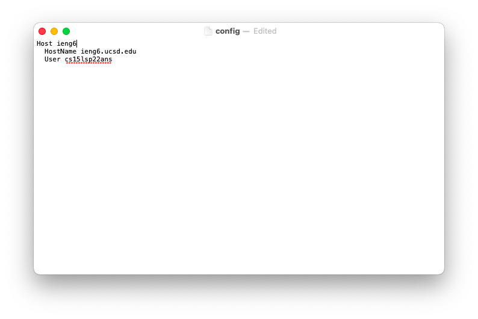

After save the file. You will now be able to use ssh ieng6 to log into your ieng6 remote server.
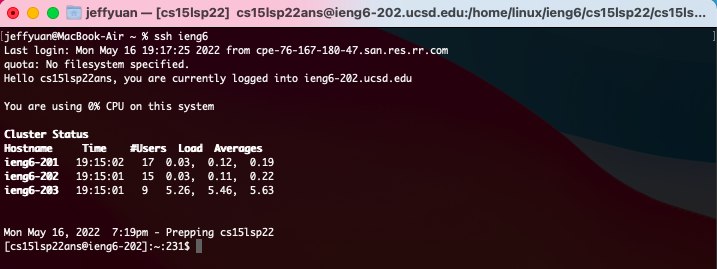

Now, let's use a scp command with the ieng6:
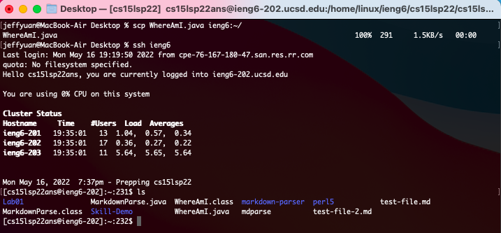

## Case #2 Setup Github Access from ieng6
The public key is stored on Github as showed in the picture below:
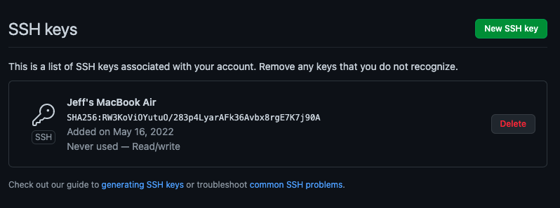

The public key is also stored in my local user account as showed in the picture below (the files ending with .pub):
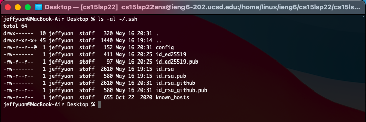
The above picture also showed the private key that stored in my local user account (the files ending without .pub)

The picture below is showing the running git commands to commit and push a change to Github while logged into my ieng6 account:
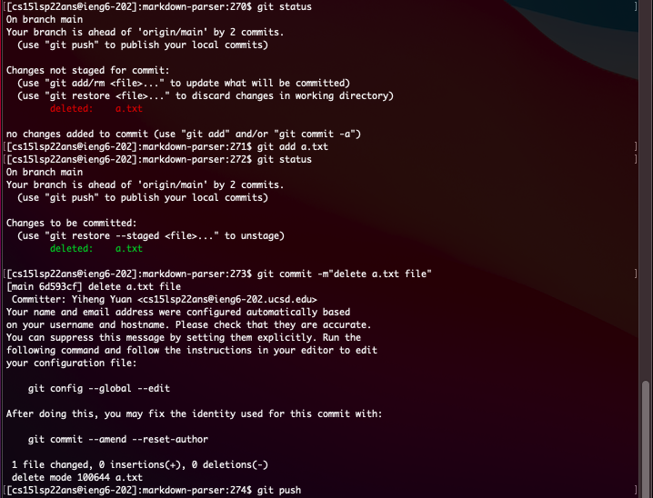

The link for the resulting commit is ***[Here](https://github.com/jeffyuan2022/markdown-parser/commit/90106da7bfbf44b6409eb6fa30f9749056bd16ff)***

## Case #3 Copy whole directories with scp -r
The picture below is a screenshot of me copying my whole amrkdown-parse directory to my ieng6 account:
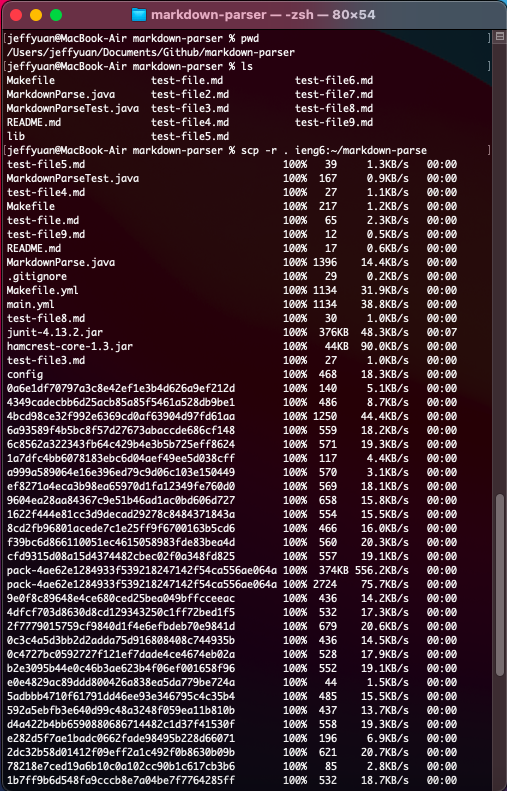
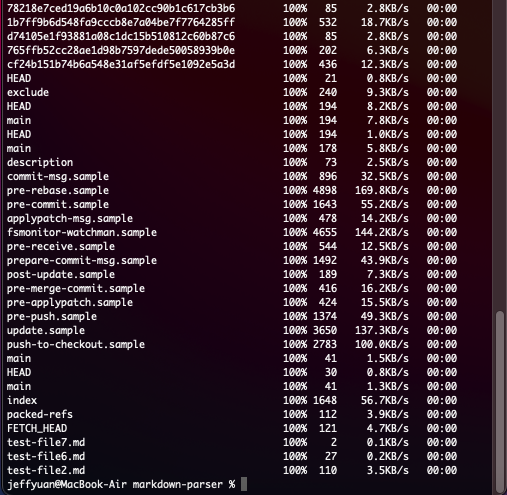

The picture below is a screenshot of me logging into my ieng6 account after copying and compiling and running the tests for my repository:
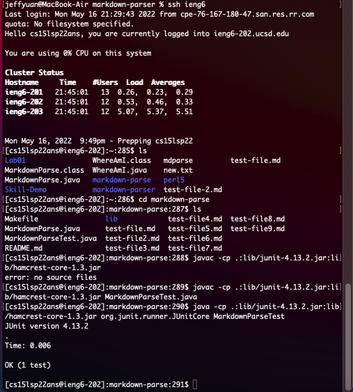

The picture below is a screenshot of me running the combining the scp and ssh code:
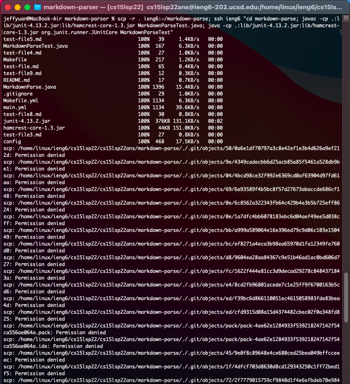
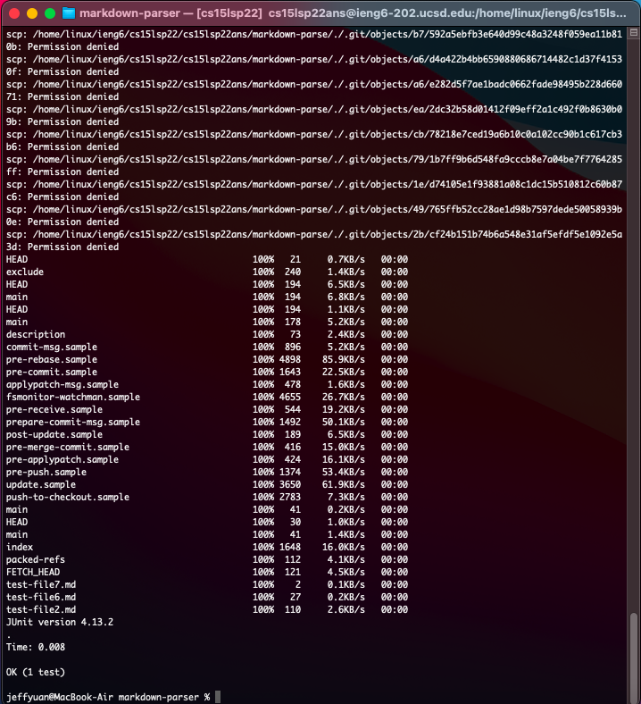

The code is: 

markdown-parser % scp -r . ieng6:~/markdown-parse; ssh ieng6 "cd markdown-parse; javac -cp .:lib/junit-4.13.2.jar:lib/hamcrest-core-1.3.jar MarkdownParseTest.java; java -cp .:lib/junit-4.13.2.jar:lib/hamcrest-core-1.3.jar org.junit.runner.JUnitCore MarkdownParseTest"
