# Lab Report 4
Link to my markdown-parse repository: [***Link Here***](https://github.com/jeffyuan2022/markdown-parser.git)

Link to the reviewed repository from week 7 lab: [***Link Here***](https://github.com/jeffyuan2022/ednafiles.git)

---

## **Snippet 1:**

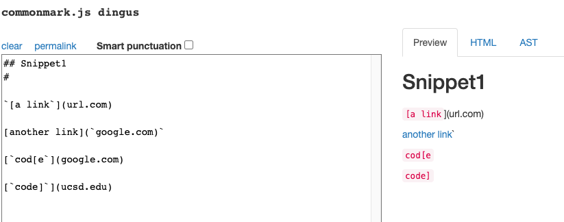

- From the preview above, we can see that the **Expected Output** is: 

    ```[`google.com, google.com, ucsd.edu]```

- The **Test Case** for Snippet 1:

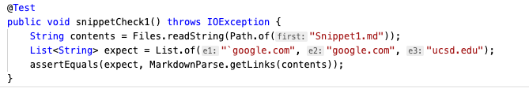

- The Output from my MarkdownParseTest:

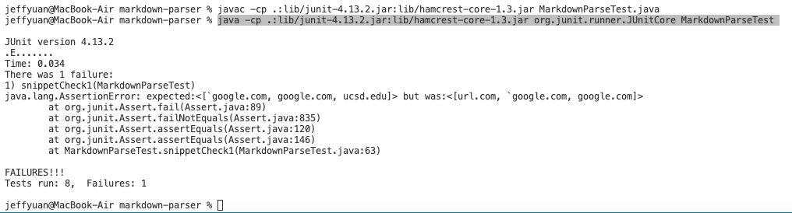

- The Output from reviewed MarkdownParseTest:

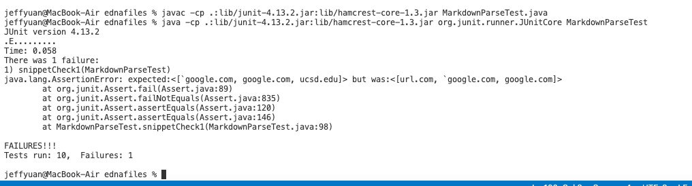

---

## **Snippet 2:**

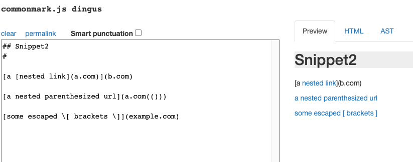

- From the preview above, we can see that the **Expected Output** is: 

    ```[a.com, a.com(()), example.com]```

- The **Test Case** for Snippet 2:

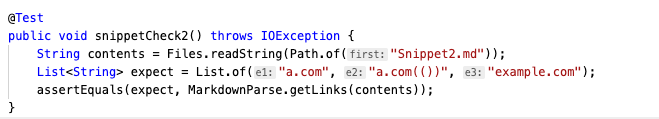

- The Output from my MarkdownParseTest:

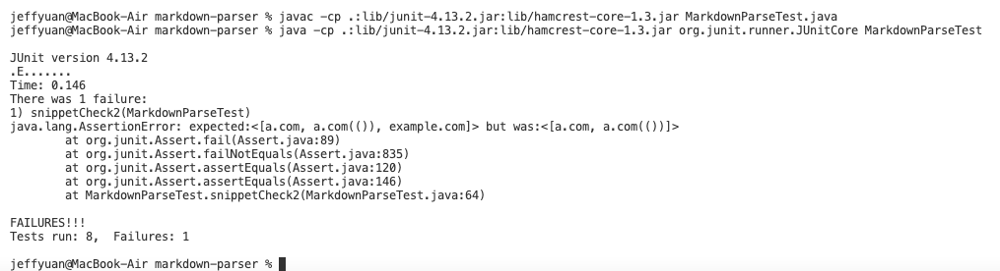

- The Output from reviewed MarkdownParseTest:

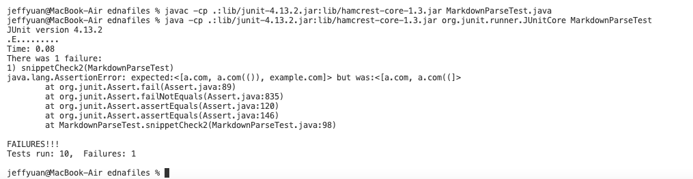

---

## **Snippet 3:**

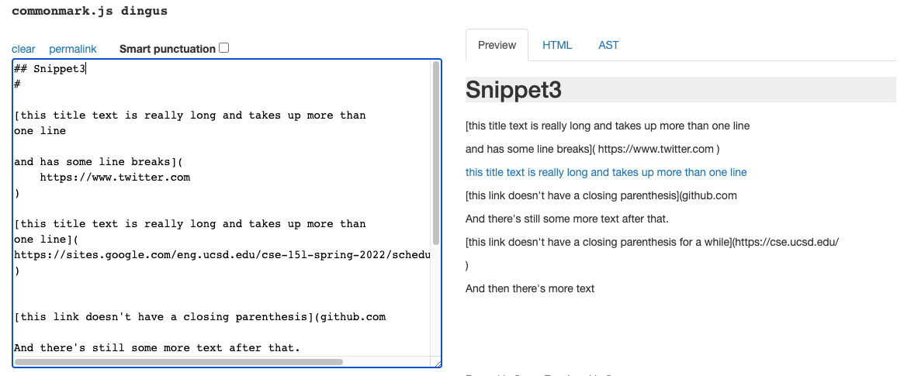

- From the preview above, we can see that the **Expected Output** is: 

    ```[https://sites.google.com/eng.ucsd.edu/cse-15l-spring-2022/schedule]```

- The **Test Case** for Snippet 3:

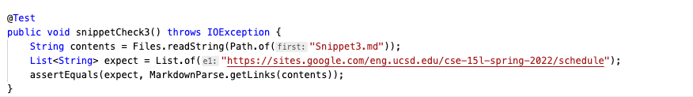

- The Output from my MarkdownParseTest:

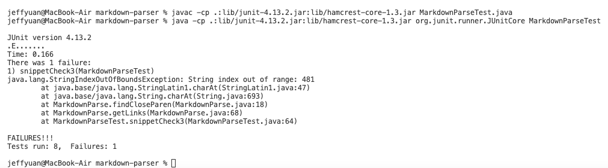

- The Output from reviewed MarkdownParseTest:

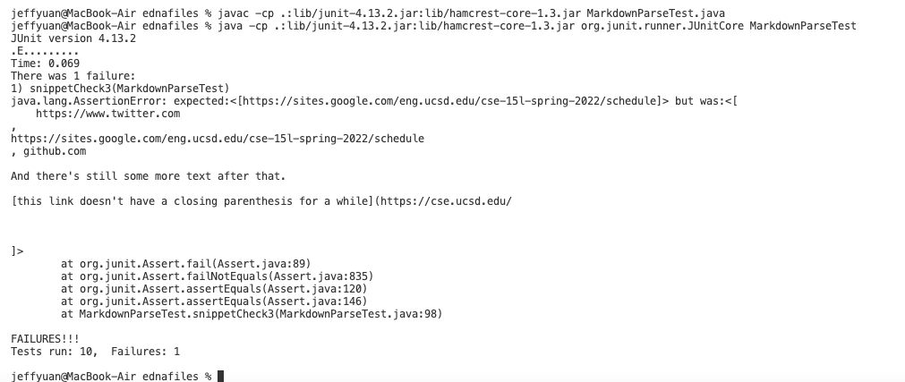

---

## **Q&A:**
1. Do you think there is a small (<10 lines) code change that will make your program work for snippet 1 and all related cases that use inline code with backticks? If yes, describe the code change. If not, describe why it would be a more involved change.
> Answer: I think a small code change will make the program work for snippet 1. When checking the bracket and parenthesis indices, it should also check if there are brackets surrounding (covering) the back-ticks. If so, the link is still value; if not, ignore the invalid link.
2. Do you think there is a small (<10 lines) code change that will make your program work for snippet 2 and all related cases that nest parentheses, brackets, and escaped brackets? If yes, describe the code change. If not, describe why it would be a more involved change.
> Answer: I think a small code change will make the program work for snippet 2. When checking the brackets indices, it should also check if there is valid paired brackets (open bracket and close bracket) inside another paired brackets. If so, consider only the outer brackets and the link is still value; if not, ignore the invalid link.
3. Do you think there is a small (<10 lines) code change that will make your program work for snippet 3 and all related cases that have newlines in brackets and parentheses? If yes, describe the code change. If not, describe why it would be a more involved change.
> Answer: I think a small code change will make the program work for snippet 3. The code should check if the link contains spaces and/or line breaks away from the parentheses and brackets. If so, the link is invalid and will be ignored.