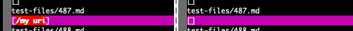
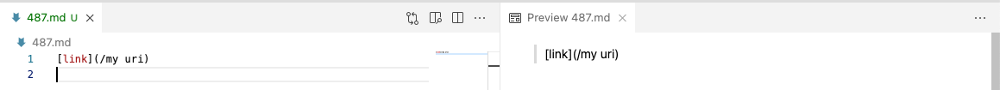
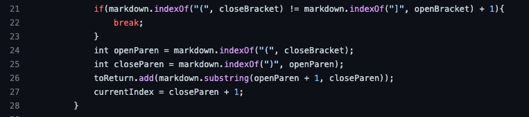
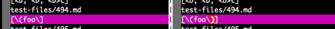
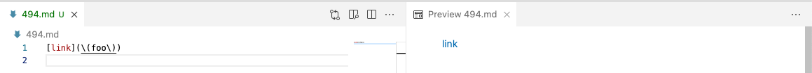

# Lab report 5:
In this lab, we are going to take a look of different results with different markdown-parser.java for the same test-file. We will then compare them, conclude what caused the difference, and possible way to fix it.

---

## Case 1:
The link to the test file: [487.md](https://github.com/nidhidhamnani/markdown-parser/blob/main/test-files/487.md)

- I used `vimdiff` on the results of running a bash for loop to find the test file with different outputs: 

The code on the left (**my code**) has the output as `[/my uri]`; the code on the right (**given code**) has the output as `[]`

- The test file and expected output in VSCode: 

The expected output: `[]`

It turns out that my code (the code on the left in `vimdiff`) have some bugs that caused the different output than the expected one.

### Explanation about the **bug**:
> I need to add a test case to make sure that the valid link will contains ***no whitespace*** in between the words inside the parentheses. If there is one or more whitespace in between the words inside the parentheses, that parentheses is invalid and will be excluded from the output.
> The test case need to add in between line 24 and line 25: 

---

## Case 2:
The link to the test file: [494.md](https://github.com/nidhidhamnani/markdown-parser/blob/main/test-files/494.md)

- I used `vimdiff` on the results of running a bash for loop to find the test file with different outputs: 

The code on the left (**my code**) has the output as `[\(foo\]`; the code on the right (**given code**) has the output as `[\(foo\)]`

- The test file and expected output in VSCode: 

The expected output: `[\(foo\)]`

It turns out that my code (the code on the left in `vimdiff`) have some bugs that caused the different output than the expected one.

### Explanation about the **bug**:
> I need to add a test case to ignore the open or close parentheses if it is right after a backslash (`\`) so that it will count as contents inside the valided parentheses for a valided link.
> The test case need to add in between line 24 and line 25: 
